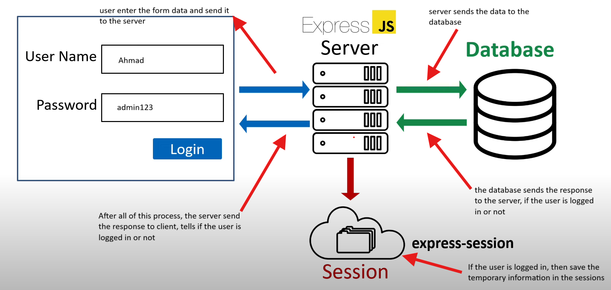

# 🔹Authentication in Express.js

Authentication means user login, we will check if the user is authenticated or not



## 👉🏻 Bcrypt Package

We will use bcrypt package to encrypt the passwords for security and store it in the database.

### For example:

- User enters the password: admin123
- With bcrypt, it will look like this "$2a$12$rt8O4A63n5lVNdMmNVdFFexidor54aRNpdVSmMCyYD1c4VBjop8ja"
- This technique is called __hashing__.

## 👉🏻 Getting started with bcrypt

```javascript
npm install bcryptjs
```

Import the package in your script file 

```javascript
import bcrypt from 'bcryptjs'
```

Saving password

```javascript
const hashedPassword = bcrypt.hash(password, 10)

// This hash method work in asynchronous way
// the 2nd parameter '10', it is called salting. It tells how strong a password must be.
```

Comparing password

```javascript
const isMatch = bcrypt.compare('admin123', hashedPassword)

// This compare method also work in asynchronous way
// if the password is matched, it will return true otherwise false.
```

For more info about bcrypt: [Click here](https://www.npmjs.com/package/bcryptjs)