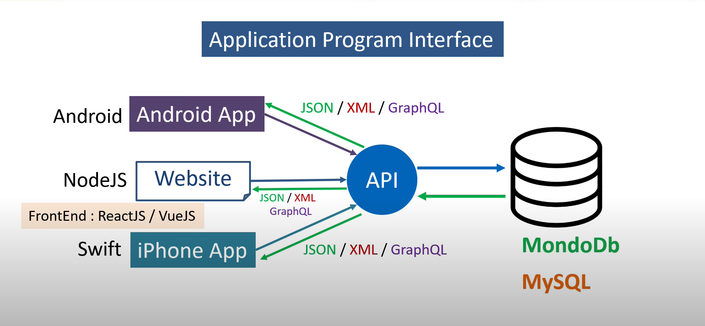

# 🔹API in Express.js

API stands for __Application Program Interface__.

For example, your website is developed with Node.js, with a database (MongoDB, MySQL). Now we want to show the data in the mobile apps. The frontend part of the app is built with some libraries like React.js etc. They have nothing to do with the backend. To connect the frontend with the backend, we develop interface called __APIs__. The frontend doesn't call directly to the database for the data. They send the request to the __API__. Once the request is sent, the database sends the data to the frontend as a __response__.

---



As you can can see in the picture, the APIs can __*send*__ or __*receive*__ the __*request*__ or __*response*__ in many formats.

- __*JSON*__ is the most popular and commonly used format because it is fast and lightweight.

- __*GraphQL*__ is also becoming popular in the web tech market.

---

## 👉🏻 Getting started with API Development

- For __Read__, we use *get* method 

```javascript
app.get('/profile', ( req, res ) => { })
```

- For __Create__, we use *post* method 

```javascript
app.post('/profile', ( req, res ) => { })
```

- For __Update__, we use *put* method 

```javascript
app.put('/profile', ( req, res ) => { })
```

- For __Delete__, we use *delete* method 

```javascript
app.delete('/profile', ( req, res ) => { })
```

Whenever we want to read the data or create the data, we will use JSON format, and for that, we will use the *json()* method.

```javascript
res.json()
```

For the API development, we will use the following middleware

```javascript
app.use(express.json())
```