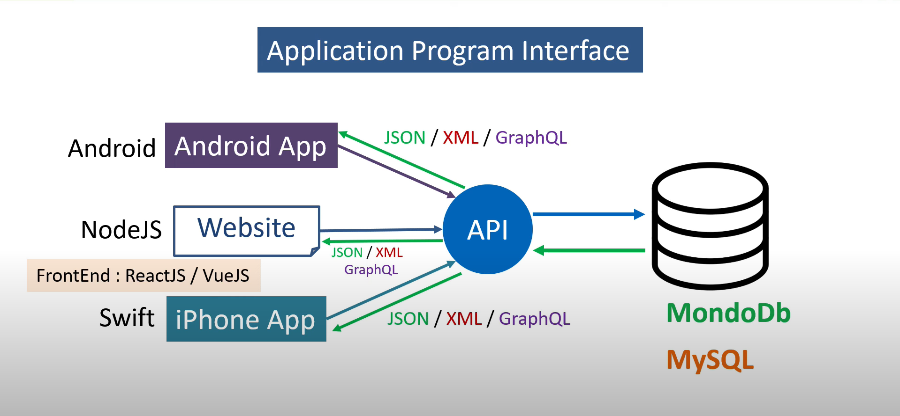

# 🔹 API in Express.js

API stands for __Application Program Interface__.

For example, your website is developed with Node.js, with a database (MongoDB, MySQL). Now we want to show the data in the mobile apps. The frontend part of the app is built with some libraries like React.js etc. They have nothing to do with the backend. To connect the frontend with the backend, we develop interface called __APIs__. The frontend doesn't call directly to the database for the data. They send the request to the __API__. Once the request is sent, the database sends the data to the frontend as a __response__.

---



As you can can see in the picture, the APIs can __*send*__ or __*receive*__ the __*request*__ or __*response*__ in many formats.

- __*JSON*__ is the most popular and commonly used format because it is fast and lightweight.

- __*GraphQL*__ is also becoming popular in the web tech market.

---

## 👉🏻 Getting started with API Development

- For __Read__, we use *get* method 

```javascript
app.get('/profile', ( req, res ) => { })
```

- For __Create__, we use *post* method 

```javascript
app.post('/profile', ( req, res ) => { })
```

- For __Update__, we use *put* method 

```javascript
app.put('/profile', ( req, res ) => { })
```

- For __Delete__, we use *delete* method 

```javascript
app.delete('/profile', ( req, res ) => { })
```

Whenever we want to read the data or create the data, we will use JSON format, and for that, we will use the *json()* method.

```javascript
res.json()
```

For the API development, we will use the following middleware

```javascript
app.use(express.json())
```

---

# 🔹 Image Upload with Multer

Multer is the third party library/package, which is used to upload images using API's.

## 👉🏻 Getting started with Multer

First, we will install the [Multer](https://www.npmjs.com/package/multer) using __npm__

```javascript
npm install multer
```

Second, we will include the multer package in our specific file, with path path package from express

```javascript
import multer from 'multer';
import path from 'path';
```

In multer, it contains various components that we need

- Mutler
    - __Storage__ - *for storing image files in specific destination with original or different filename*
        - Destination
        - Filename
    - __Limits__ - *it specifies what will be the file size or the how many number of files*
        - fileSize
        - files
        - fields
        - fieldNameSize
    - __File Filter__ - *it specifies what type of files the users can upload*
        - Image
        - PDF
        - Word
        - Excel
        - Video

### If the user does not use the file filter option, then user can upload any type of image or file.

---

# 👉🏻 How to use API in Frontend?

We will use the package called __CORS__ to connect the frontend with the backend. We will use the JavaScript fetch() method to connect the frontend with the backend.

## 🔹 Express.JS CORS

let's suppose, we create the API in the origin, for example, www.test.com. Suppose our frontend and backend are working on the same URL, so we don't need the CORS package.

Let's suppose, the backend is working on "www.test.com" and want to see our frontend on the "www.xyz.com". But it's not possible. Because our express server will not let the desired frontend URL to use its API's.

So, to let the frontend to use backend API's, we will use the CORS package.

__CORS__ stands for *Cross Origin Resource Sharing*

CORS is not just the package, it is the most important topic when we are working with the API's. When we create our API's, we pass the headers to the CORS, which tells which websites will be able to access the API's

Now let's say, we pass the CORS to the Express.js server, so every other link will be able to access the backend API's.

We can set the specific conditions to make sure which URL will be able to access the API's.

## 🔹 Getting Started with CORS

First, we will install the CORS package

```javascript
npm install cors
```

Second, we will import the cors package to the main file e.g. server.js

```javascript
import cors from 'cors'
```

We always use cors as a middleware

```javascript
app.use(cors());
```

Now the routes behind the middleware will be able accept the request from different URL's

To give access to the specific single route, we will use the cors() as the middleware in that route.

```javascript
app.get('/profile', cors(), (req, res) => {
    // your code here
})
```

Allow access to specific Origin:

```javascript
const corsOptions = {
    origin: 'http://localhost:3000',
    // origin: specifies that only this URL can access the API's 
    methods: ['GET', 'POST'],
    // methods: specifies which methods can be used here.
    allowedHeaders: ['Content-Type', 'Authorization'],
    // allowedHeaders: in which we can pass different headers, here 'Content-Type' means the data send by GET or POST will be in the form of JSON. And 'authorization' means that request is from the authorized user or not. In that case, the user must be logged in to send the requests.
    optionsSuccessStatus: 200,
    // return the status code, specifying whether the data is retrieved or saved, the status will be OK.
}

app.use(cors(corsOptions));
```

We can also use the following method

```javascript
const corsOptions = {
    origin: 'http://localhost:3000',
    credentials: true,
}
```